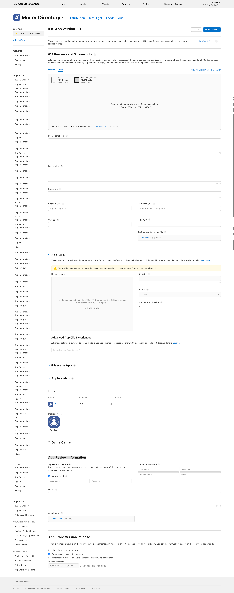
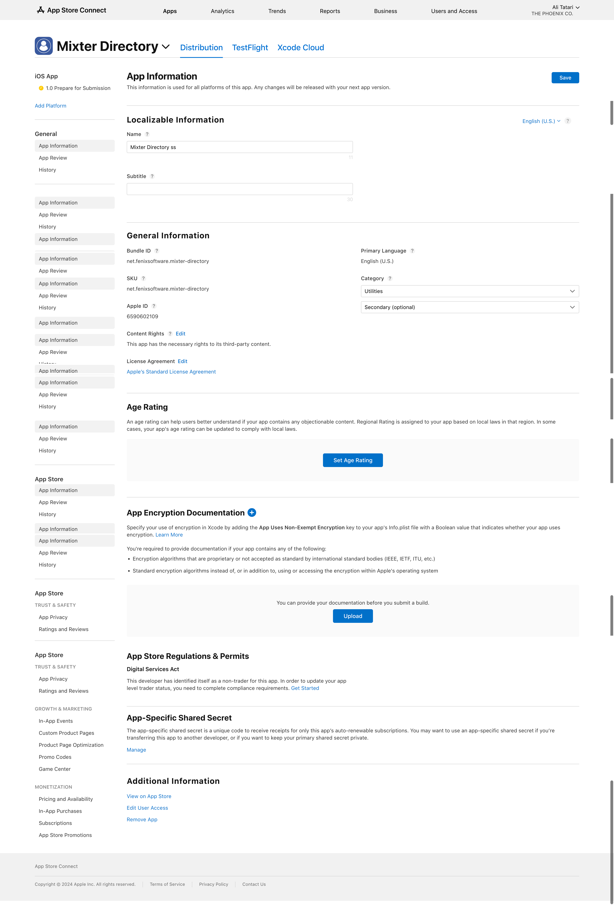
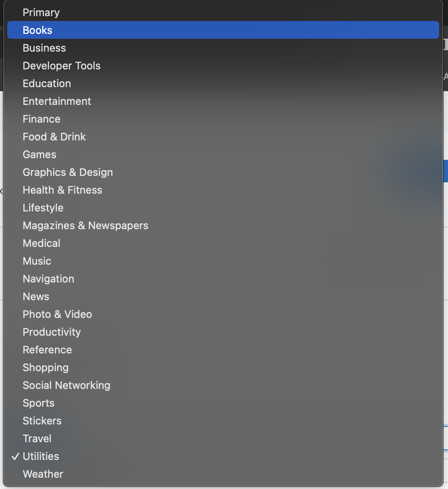

# iOS Previews and Screenshots
Adding accurate screenshots of your app on the newest devices can help you represent the app’s user experience. Keep in mind that we’ll use these screenshots for all iOS display sizes and localizations. Screenshots are only required for iOS apps, and only the first 3 will be used on the app installation sheets.

## iPhone
### Phone 6.7": 

> Drag up to 3 app previews and 10 screenshots here.
(1290 x 2796px or 2796 x 1290px)

### iPhone 6.5" Display (Required): 

> Drag up to 3 app previews and 10 screenshots here.
(1242 x 2688px, 2688 x 1242px, 1284 x 2778px or 2778 x 1284px)

### iPhone 5.5" Display (Required)

> Drag up to 3 app previews and 10 screenshots here.
(1242 x 2208px or 2208 x 1242px)

## iPad

### iPad 13" Display(Required)
> Drag up to 3 app previews and 10 screenshots here.
(2064 x 2752px, 2752 x 2064px, 2048 x 2732px or 2732 x 2048px)

### iPad Pro (2nd Gen) 12.9" Display (Required)
> Drag up to 3 app previews and 10 screenshots here. 
(2048 x 2732px or 2732 x 2048px)

## Promotional Text
> Promotional text lets you inform your App Store visitors of any current app features without requiring an updated submission. This text will appear above your description on the App Store for customers with devices running iOS 11 or later, and macOS 10.13 or later.

## Description
> A description of your app, detailing features and functionality.

## Keywords 
> Include one or more keywords that describe your app. Keywords make App Store search results more accurate. Separate keywords with an English comma, Chinese comma, or a mix of both.

## Support URL
> A URL with support information for your app. This appears on your app’s product page once you release your app on the App Store.

## Marketing URL
> A URL with marketing information about your app. This URL will be visible on the App Store.

## Version 
> The version of the app you are adding. Numbering should follow software versioning conventions.

## Copyright
> The name of the person or entity that owns the exclusive rights to your app, preceded by the year the rights were obtained (for example, "2008 Acme Inc."). Do not provide a URL.

## Routing App Coverage File
> Specify the geographic regions supported by your app. The file must be in the .geojson format and can only contain one MultiPolygon element. 
[Learn More](https://developer.apple.com/help/app-store-connect/reference/platform-version-information)

# App Clip
> You can set up a default app clip experience in App Store Connect. Default app clips can be invoked only in Safari by a meta tag and must include a valid domain. [Learn More](https://developer.apple.com/help/app-store-connect/offer-app-clip-experiences/overview-of-app-clips)

>**Note:** To provide metadata for your app clip, you must first upload a build to App Store Connect that contains a clip.

## Header Image:
> Header image must be in the JPG or PNG format and the RGB color space. It must also be 1800 x 1200 pixels.

## Subtitle:
> A concise phrase that helps express your app clip’s purpose. A subtitle can be up to 56 characters long.

## Action
> The button label that appears on the app clip card. Select a verb that best fits your app clip.

## Advanced App Clip Experiences
Advanced settings allows you to set up multiple app clip experiences, associate them with places in Maps, add NFC tags, and more.

# App Information

## Name: (Max 30s Character)
> The name will be reviewed with the next submission of your app.
## Subtitle: (Max 30 Character)
> A summary of your app that will appear under your app’s name on your App Store product page. This can’t be longer than 30 characters.

## Primary Language
>If localized app information isn’t available in a country or region, the information from your primary language will be used instead.

## Category
> The category that best describes this app.

# Support Language
English (U.S.)
Arabic
Catalan
Chinese (Simplified)
Chinese (Traditional)
Croatian
Czech
Danish
Dutch
English (Australia)
English (Canada)
English (U.K.)
Finnish
French
French (Canada)
German
Greek
Hebrew
Hindi
Hungarian
Indonesian
Italian
Japanese
Korean
Malay
Norwegian
Polish
Portuguese (Brazil)
Portuguese (Portugal)
Romanian
Russian
Slovak
Spanish (Mexico)
Spanish (Spain)
Swedish
Thai
Turkish
Ukrainian
Vietnamese